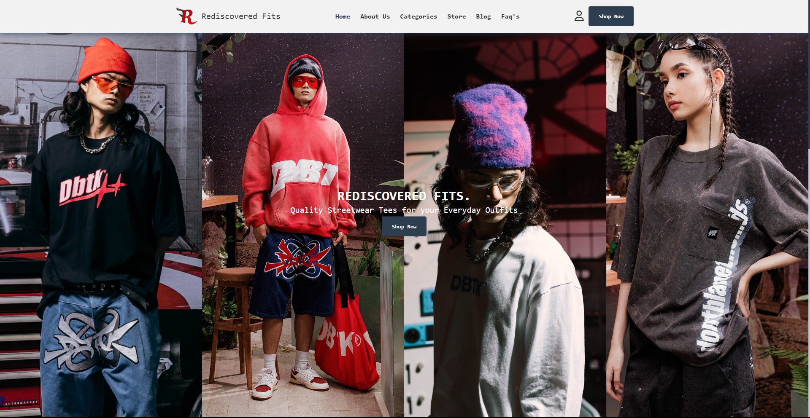

# Rediscovered Fits
> A static website showcasing various locally made Philippine brands, designed to simulate the concept of e-commerce.

[🚀 Project Demo »](http://rediscovered-fits-r1.vercel.app/)

This project serves as the final requirement for the Programming Fundamentals course. The goal is to apply fundamental programming concepts while creating a visually appealing and functional online storefront.

## Built with 

## Meta
Ace Gabriel P. Pasiliao – [@celerity_labs](https://x.com/celerity_labs) – acegabriel0809@gmail.com
